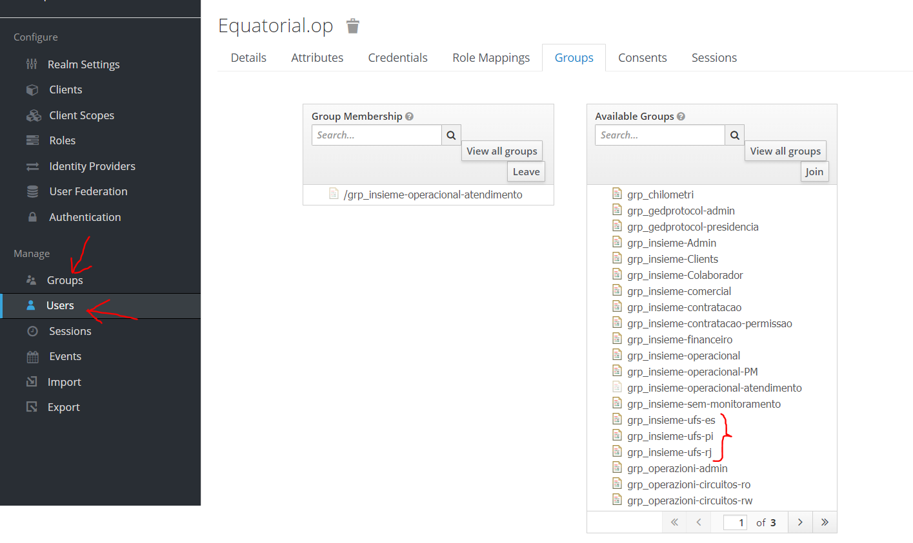

# insieme-frontend

O projeto frontend-insieme foi construído utilizando-se como framework principal o Vue.js. Para acelerar ainda mais o desenvolvimento das interfaces gráficias, também foi utilzado o framework [`Vuetify`](https://vuetifyjs.com) que é compatível com Vue.js e tem como base a ferramenta [`VueCLI`](http://cli.vuejs.org)

> A IDE preferêncial para este projeto é o [`VSCode`](https://code.visualstudio.com/). Mas você pode configurar uma outra IDE de sua preferência para compilar e executar o projeto.

Abaixo é apresentado a arquitetura de alto nível do projeto e como os pacotes principais se interrelacionam.


O arquivo principal de todo projeto Vue.js é o App.vue.

>Repare que a barra lateral de relatório está localizada exatamente neste arquivo principal. Foi a forma encontrada para permitir que o relatório aparecesse acima de todas as telas do Insieme.

### **A pasta Views**

Ela contém todos os arquivos .vue das páginas do Insieme. Nem todas tem url associada para serem acessadas pelo campo de endereço do Browser.

Para novas telas que apresentem url, após criar um novo arquivo .vue, é necessário cadastrar a rota desta url no arquivo [`/router/index.js`](src/router/index.js). Um exemplo é mostrado abaixo para a tela de contratos:

```javascript
 {
        path: 'contratos',
        name: 'Contracts',
        props: true,
        component: () => import('../views/ContractsPage.vue')
},
```

Desta forma, se você quiser ir para esta página programaticamente através de um evento de botão, basta executar este comando dentro do evento de click:

```javascript
this.$router.push('/contratos')
```

Para mais detalhes sobre o roteamento de telas, estude a bilbioteca [`Vue Router`](https://router.vuejs.org/) usada neste projeto.

### **A pasta Components**

Esta pasta contém todos os componentes customizados para serem reutilizados por todas as páginas do projetos e também podem ser usados como base para a construção de novos componentes.

### **A pasta Services**

Esta pasta guarda arquivos javascript que funcionam como utilitários para todo o projeto.

- [`AuthService`](src/services/AuthService.js) - Utilitário que oferece funções para logar e deslogar do Keycloak e para veririficar informações de perfil do usuário logado.

- [`HttpService`](src/services/HttpService.js) - Utilitário que esconde as conplexidades relacionadas a chamadas HTTP. Oferece funções que fazem as operações básicas de GET/POST/PUT/DELETE e faz tratamento posterior em caso de erro. Utiliza a biblioteca [`Axios`](https://www.npmjs.com/package/axios) para fazer as requisições.

- [`ExportService`](src/services/ExportService.js) - Utilitário que oferece uma função para auxiliar na exportação de arquivos em formato .csv.

- [`UtilService`](src/services/UtilService.js) - Utilitário genérico que oferece funções para formatação de data e hora, além de exibir e esconder o botão do Chat Bot da Huggy.

### **Internacionalização**

Existem dois arquivos que contém os bundles de todas as mensagens e rótulos do Insieme. O arquivo [`i18n/pt.ts`](src/i18n/pt.ts) está em portugues e o outro [`i18n/en.ts`](src/i18n/en.ts) em inglês. Ambos contém a mesma lista de bundles mas cada um em seu idioma específico.

Abaixo os comandos principais para compilar e rodar o projeto:

### Configuração inicial

Dentro do VSCode, na tela de terminal `Ctrl + "`, execute o comando abaixo para compilar o projeto.

```
npm install
```

Depois execute o comando abaixo para iniciar localmente o frontend:

```
npm run serve
```

Em seguinda basta acessar o Insieme pela url `http://localhost:8081`.

### Deployment em Produção/Homologação

Logado na máquina que será feito o deployment, vá para o diretório
`/var/www/html/insieme`. Em seguida digite o comando git para baixar
possíveis atualizações:

```
sudo git pull http://192.168.100.146:7990/scm/insieme/insieme-frontend.git
```

Por fim, execute o comando de iniciar o frontend:

```
sudo npm run build
```

### NGINX

Caso seja necessário configurar certificados SSL ou rotas de provimento de páginas, o Nginx é o responsável por redirecionar
as chamadas das páginas do Insieme. O arquivo de configuração é:

```
/etc/nginx/sites-enabled/default
```

### Lints and fixes files

```
npm run lint
```

### Customize configuration

See [Configuration Reference](https://cli.vuejs.org/config/).

### Configurando usuário para acessar circuitos por UFs

Dentro do Keycloak (https://auth.telespazio.com.br) existe uma lista de grupos de permissionamento por UFs que podem ser associados a um usuário específico. Assim, se um usuário só pode ver circuitos do RJ, associe o grupo `grp_insieme-ufs-rj`, como mostra a figura abaixo:




### Configurando usuário para acessar contratos por país

Dentro do Keycloak (https://auth.telespazio.com.br) existe uma lista de grupos de permissionamento por país que podem ser associados a um usuário específico. Assim, se um usuário só pode ver contratos da Colômbia, associe tanto o grupo `grp_insieme-Admin` como o grupo `grp_insieme-pais-colombia`, como mostra a figura abaixo. Caso você associe apenas o grupo `grp_insieme-Admin`, o usuário terá acesso a todos os contratos do Insieme.


