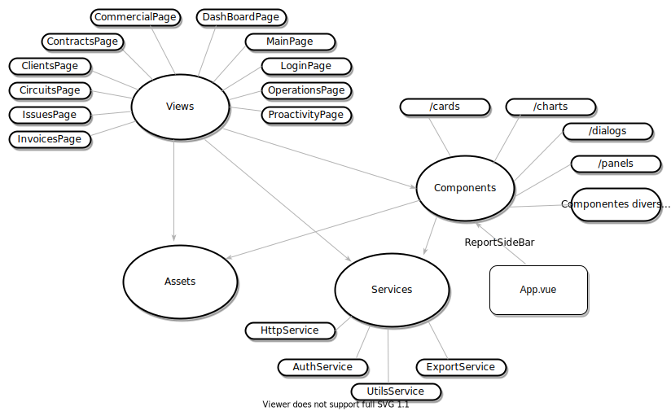

# insieme-frontend

O projeto frontend-insieme foi construído utilizando-se como framework principal o Vue.js. Para acelerar ainda mais o desenvolvimento das interfaces gráficias, também foi utilzado o framework [`Vuetify`](https://vuetifyjs.com) que é compatível com Vue.js e tem como base a ferramenta [`VueCLI`](cli.vuejs.org)

Abaixo é apresentado a arquitetura de alto nível do projeto e como os pacotes principais se interrelacionam.



Repare que a barra lateral de relatório está localizada dentro do arquivo principal App.vue. Foi a forma encontrada para permitir que o relatório aparecesse acima de todas as telas do Insieme.

Para novas telas que apresentem url, após criar um novo arquivo .vue, é necessário cadastrar a rota desta url no arquivo `/router/index.js`. Um exemplo é mostrado abaixo para a tela de proatividade:

```javascript
{
        path: 'proatividade', //aparecerá no final da url
        name: 'Proactivity',
        props: true,
        component: () => import('../views/ProactivityPage.vue')
},
```

Desta forma, se você quiser ir para esta página programaticamente através de um evento de botão, basta executar este comando dentro do evento de click:

```javascript
this.$router.push('/proatividade')
```

Para mais detalhes sobre o roteamento de telas, estude a bilbioteca [`Vue Router`](https://router.vuejs.org/) usada neste projeto.

### **A pasta Services**

Esta pasta guarda arquivos javascript que funcionam como utilitários por todo o projeto.

- `AuthService` - Utilitário que oferece funções para logar e deslogar do Keycloak e para veririficar informações de perfil do usuário logado.

- `HttpService` - Utilitário que esconde as conplexidades relacionadas a chamadas HTTP. Oferece funções que fazem as operações básicas de GET/POST/PUT/DELETE e faz tratamento posterior em caso de erro. Utiliza a biblioteca [`Axios`](https://www.npmjs.com/package/axios) para fazer as requisições.

- `ExportService` - Utilitário que oferece uma função para auxiliar na exportação de arquivos em formato .csv.

- `UtilsService` - Utilitário genérico que oferece funções para formatação de data e hora, além de exibir e esconder o botão do Chat Bot da Huggy.

Abaixo os comandos principais para compilar e rodar o projeto:

### Project setup

```
npm install
```

### Compiles and hot-reloads for development

```
npm run serve
```

### Compiles and minifies for production (Executar na máquina de Produção/Homologação)

```
npm run build
```

### Lints and fixes files

```
npm run lint
```

### Customize configuration

See [Configuration Reference](https://cli.vuejs.org/config/).
